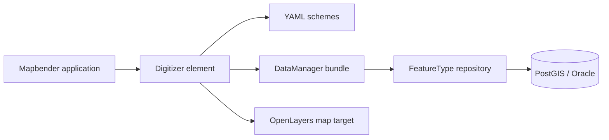

**Mapbender Digitizer** is a core [Mapbender](https://www.osgeo.org/projects/mapbender/) product module for **browser-based spatial feature editing** — built during employment at **WhereGroup GmbH** and still maintained upstream ([release 2.0.8](https://github.com/mapbender/mapbender-digitizer/releases), Mar 2026).

**Repository**: [github.com/mapbender/mapbender-digitizer](https://github.com/mapbender/mapbender-digitizer) · **Docs**: [Digitizer element](https://docs.mapbender.org/develop/en/elements/editing/digitizer.html) · **My commits**: **344** (3rd top contributor)

## What it is

Digitizer is a Mapbender **sidepane element** that lets users:

- **Draw and edit** point, line, and polygon geometries on the map
- **Capture attributes** via YAML-defined forms (tabs, validation, file upload, datepicker)
- **List and filter** features in HTML tables with spatial search
- **Persist** to PostgreSQL/PostGIS (Oracle/SpatiaLite experimental)

Unlike Mapbender's Sketch element, Digitizer stores geometries in **database tables** — suitable for production capture workflows (damage reporting, asset inventory, municipal planning).

## Architecture

Each **scheme** defines: connection, table, geometry type, toolset (`drawPolygon`, `modifyFeature`, `moveFeature`, …), form layout, and role-based `allowCreate` / `allowEdit` / `allowDelete`.

## Contribution

| Metric | Value |
|--------|------:|
| Commits | 344 |
| PRs | 11 |
| Reviews | 6 |
| Period | 2015–2019 |

Work included architecture, clone/duplicate features, form tooling, and integration with Mapbender's [data-source](https://github.com/mapbender/data-source) layer.

## Deployments

Digitizer shipped in Mapbender geoportals for German public-sector clients — part of a stack reaching **1M+ users** aggregate:

- **Stadt Wesseling** — Schadensmeldung (map capture + photos)
- **Kreis Lippe**, **Stadt Troisdorf** — municipal geoportals
- **Infrastructure GIS** — network asset digitization (SNH/HHVA context)

## Related modules

Built alongside **[vis-ui.js](/posts/vis-ui-js-mapbender/)** (UI generator) and print/search integrations during [WhereGroup tenure](/posts/wheregroup-mapbender-gis/).

## Tech stack

PHP · Symfony · JavaScript · PostgreSQL/PostGIS · YAML · OpenLayers

## See also

[WhereGroup / Mapbender GIS](/posts/wheregroup-mapbender-gis/) · [vis-ui.js](/posts/vis-ui-js-mapbender/)
