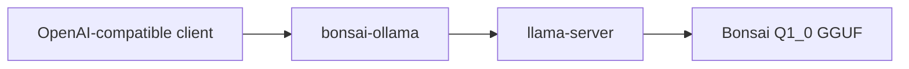

**bonsai-ollama** is an Ollama-facing HTTP proxy for **PrismML Bonsai 1.7B** (`Q1_0` GGUF) via `llama-server` — because stock Ollama cannot load `Q1_0` quantizations yet.

**Repository**: [github.com/eSlider/bonsai-ollama](https://github.com/eSlider/bonsai-ollama) · last push **2026-04-22** · ★2

## Problem

Ultra-low-bit quants (`Q1_0`) save VRAM but need a loader that supports them. Ollama's native loader rejects some formats — this proxy exposes an **OpenAI-compatible** surface while `llama-server` handles the model file.

## Stack position

## Related

- [go-ollama](/posts/go-libraries-toolkit/) — Go client for Ollama + Open WebUI
- [go-second-brain](/posts/go-second-brain-knowledge-graph-rag/) — Ollama embed/generate in RAG stack

## Tech stack

Go · llama-server · GGUF · HTTP proxy · Ollama API compatibility
