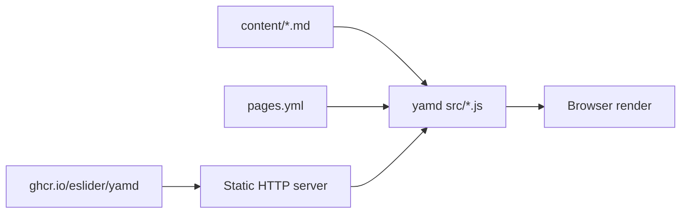

**yamd** is a client-side **Markdown + YAML** static site engine — no backend, no build step. A folder of `.md` files plus `pages.yml` is the whole stack.

**Repository**: [github.com/eSlider/yamd](https://github.com/eSlider/yamd) · **Live demo**: [eSlider.github.io/yamd/](https://eslider.github.io/yamd/) · last push **2026-06-17** · ★1

## Why it exists

- **Content-first** — GitHub-Flavored Markdown; the shell loads once; refresh when files change
- **Ships like any static site** — GitHub Pages, Netlify, S3, or your own host; engine runs in the browser
- **Nav from `pages.yml`** — sidebar filter narrows the same tree; `/` focuses filter, `Alt+N` jumps to next match
- **Vanilla ECmaScript** — no bundle step; ES modules in `src/*.js`

## Architecture



## Try locally

```bash
git clone https://github.com/eSlider/yamd.git
cd yamd
npm run dev
# → http://127.0.0.1:3456/
```

Container image published to **GHCR** on each push to `main`.

## Related

- [produktor.io](/posts/produktor-io-proprodukt/) — own-company product line
- [Docker Compose patterns](/posts/docker-compose-stack-patterns/) — deployment stacks

## Tech stack

JavaScript (ES modules) · Markdown · YAML · Docker · GitHub Pages
