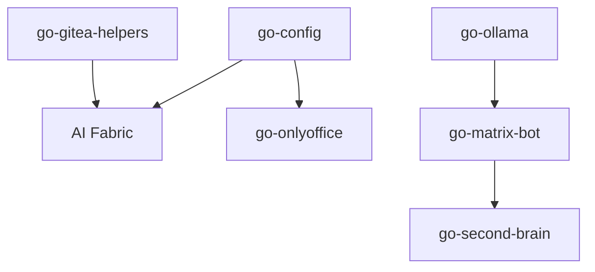

A cluster of **published Go libraries** on [github.com/eSlider](https://github.com/eSlider) — small, composable packages used across produktor.io stacks, AI Fabric, and go-second-brain.

*Inventory from `gh repo list eSlider` — 2026-06-24.*

## Libraries

| Repository | Last push | ★ | Role |
|------------|-----------|--:|------|
| [go-config](https://github.com/eSlider/go-config) | 2026-05-12 | 1 | Env/YAML/INI/JSON ↔ Go structs; multi-source merge; CLI |
| [go-ollama](https://github.com/eSlider/go-ollama) | 2026-04-17 | 2 | Ollama + Open WebUI streaming; token callbacks; code block extraction |
| [go-matrix-bot](https://github.com/eSlider/go-matrix-bot) | 2026-02-13 | 0 | Matrix bots: E2E, Ollama, Gitea, OnlyOffice hooks |
| [go-gitea-helpers](https://github.com/eSlider/go-gitea-helpers) | 2026-02-13 | 0 | Gitea API pagination (repos, issues, milestones) |
| [go-system](https://github.com/eSlider/go-system) | 2026-02-13 | 0 | Env load, YAML config, shell exec, SHA-256 checksums |
| [go-file](https://github.com/eSlider/go-file) | 2026-02-13 | 0 | Path resolution, writability, mkdir helpers |
| [go-keys](https://github.com/eSlider/go-keys) | 2026-02-13 | 0 | RSA OAEP / PKCS1v15 PEM utilities |
| [go-proxy](https://github.com/eSlider/go-proxy) | 2026-02-13 | 0 | HTTP/SOCKS proxy list fetcher (ProxyScrape) |
| [go-xls](https://github.com/eSlider/go-xls) | 2026-04-22 | 0 | UTF-16LE CSV + legacy BIFF `.xls` |

## How they compose

- **go-config** — shared configuration layer (same pattern as `godotenv` + struct tags across services)
- **go-ollama** + **go-matrix-bot** — power Matrix RAG bots in [go-second-brain](/posts/go-second-brain-knowledge-graph-rag/)
- **go-gitea-helpers** — pagination for [AI Fabric](/posts/ai-fabric-agent-delivery/) issue handler

## GitHub stats (original repos)

| Metric | Value |
|--------|------:|
| Original repos (`isFork: false`) | **62** |
| Primary language: Go | **21** repos |
| Active in 2026 | **27** repos |

## Tech stack

Go · Ollama · Matrix · Gitea · OnlyOffice
