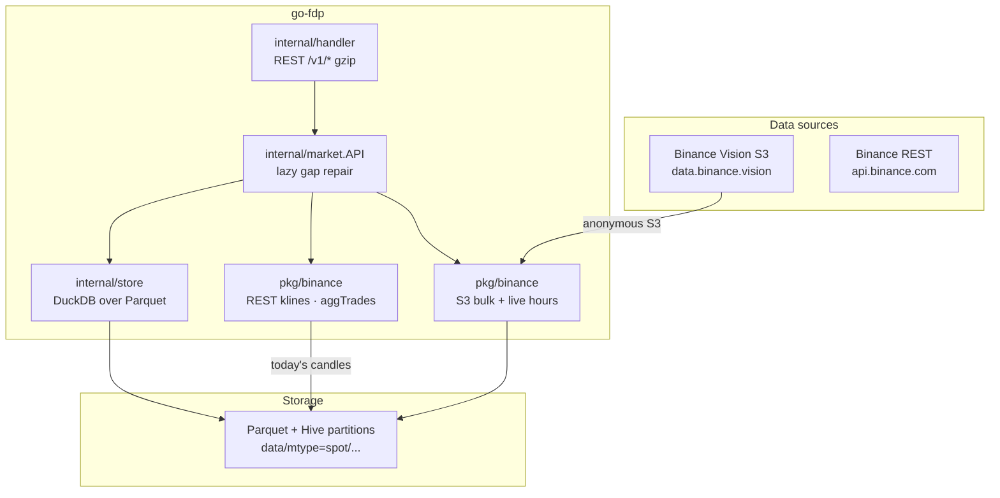
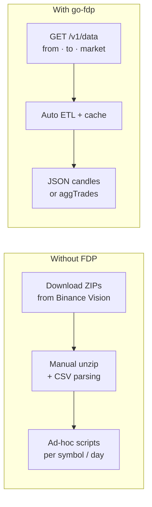
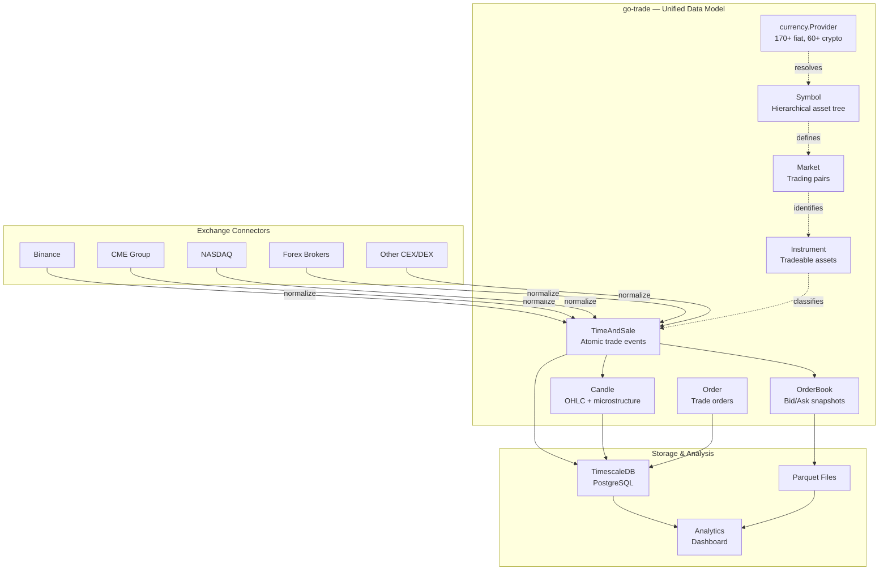
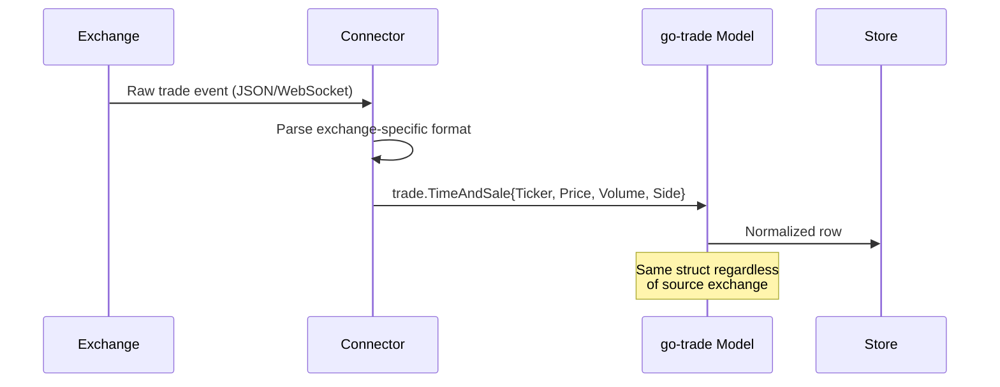

Two complementary Go libraries for market data: a **finance data proxy** and a **unified trading data model**.

**Repositories**:

- [github.com/eSlider/go-fdp](https://github.com/eSlider/go-fdp) — Binance historical klines & aggTrades from public S3 → DuckDB + Parquet cache → REST API
- [github.com/eSlider/go-trade](https://github.com/eSlider/go-trade) — cross-exchange model for candles, trades, orders, instruments, symbols, currencies

## go-fdp architecture

### Raw files vs queryable history

**Without a proxy:** manage S3 paths, daily ZIP layouts, decompression, schema mapping, and missing “today” data yourself.

**With FDP:** request a time range; the service fetches missing Parquet from S3 (or live API for the current day), runs DuckDB, and returns JSON.

## go-trade — unified data model

Exchange-agnostic types so Binance, CME, NASDAQ, and forex connectors normalize into the same structs.

### Normalization flow

## How they compose

- **go-fdp** — ingest and cache historical Binance data
- **go-trade** — shared type system for sync services and trading frontends
- Used by [Trading algorithms](/posts/trading-algorithms-binance-sync/) and [Markets Platform](/posts/markets-platform-tradeplatform/)

## Tech stack

Go · DuckDB · Parquet · Binance API · TimescaleDB · REST
