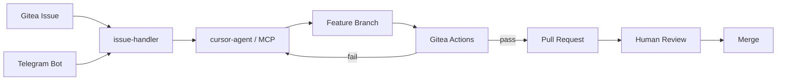

Design notes for **[AI Fabric](https://github.com/eSlider/ai-fabric)** — a self-hosted alternative to cloud-only "AI dev tools" that keeps code, issues, and runners on your own Gitea instance.

## Design goals

1. **Gitea as SSOT** — issues, branches, PRs, and Actions stay in one place
2. **Policy before merge** — `fmt`, `lint`, `test` are hard gates, not suggestions
3. **Human in the loop** — agents open PRs; humans approve merges
4. **Observable control plane** — Telegram bot for status without SSH

## Request flow

## Why not GitHub Copilot-only?

- Private Gitea (`git.produktor.io`) holds proprietary stacks
- Runners and LLM endpoints stay on-premises (Ollama-compatible)
- Issue → PR automation must respect repo-specific CI and branch policies

## Components

| Layer | Responsibility |
|-------|----------------|
| `issue-handler` | Orchestration, retries, PR body policy |
| `gitea-mcp` | Tool surface for agents (repos, issues, files) |
| `gitea-runner` | Isolated CI execution (act_runner replicas) |
| `tg-bot` | Notifications and manual triggers |

## Related

[AI Fabric project post](/posts/ai-fabric-agent-delivery/) · [produktor.io stack](/posts/produktor-io-proprodukt/)
