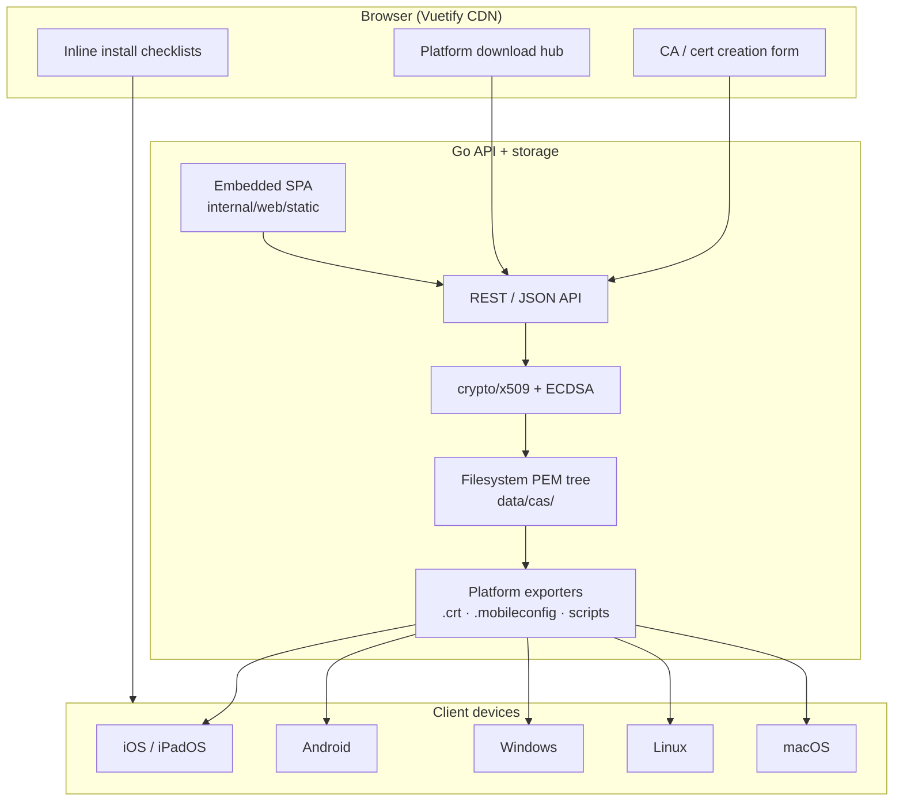

**self-ca** is a self-hosted CA web service for generating and managing private HTTPS certificates — with install flows for mobile and desktop platforms.

**Repository**: [github.com/eSlider/self-ca](https://github.com/eSlider/self-ca)

## Architecture

## Features

- Web UI for certificate issuance and renewal
- Platform-specific install helpers (iOS, Android, Windows, Linux, macOS)
- Go CLI for automation and scripting
- Embedded Vue 3 + Vuetify SPA — no frontend build step

## Use case

Homelab stacks (Gitea, OnlyOffice, [WebDAV](/posts/webdav-sharing-sftpgo-minio/), Matrix) often need trusted TLS on private networks. self-ca centralizes CA management instead of ad-hoc `mkcert` runs per machine.

## Stack

| Layer | Choice |
|-------|--------|
| Backend | Go 1.25+ — `internal/ca`, REST API, filesystem PEM store |
| Frontend | Vue 3 + Vuetify 3 via CDN |
| Storage | `data/cas/{ca-id}/` PEM tree |

## Tech stack

Go · Web UI · X.509 · ECDSA · CLI · Vue 3
