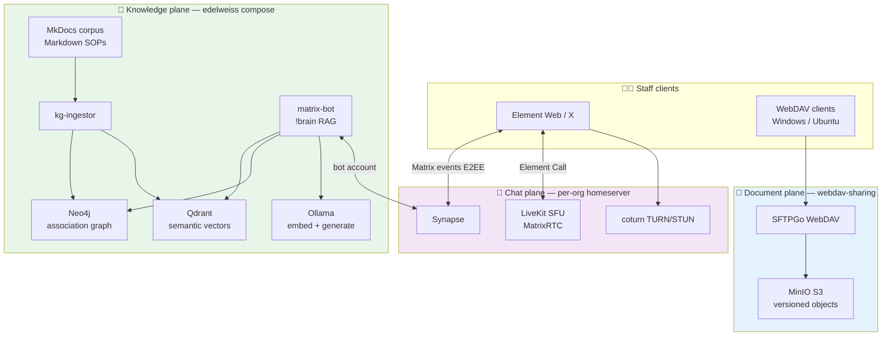
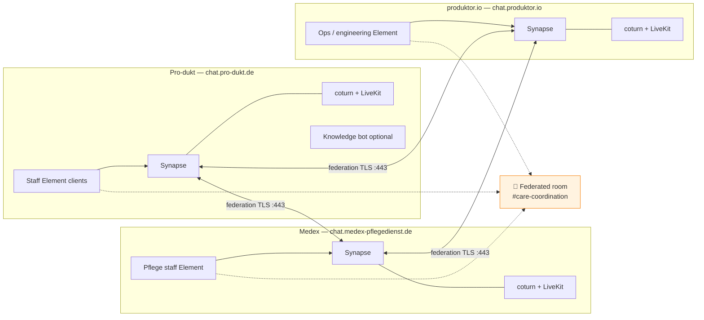
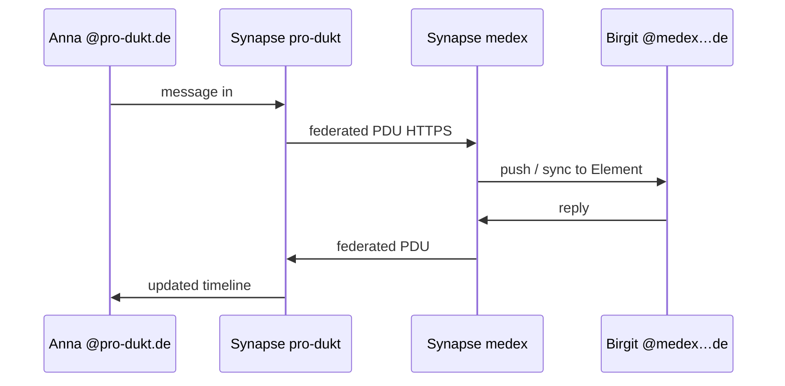
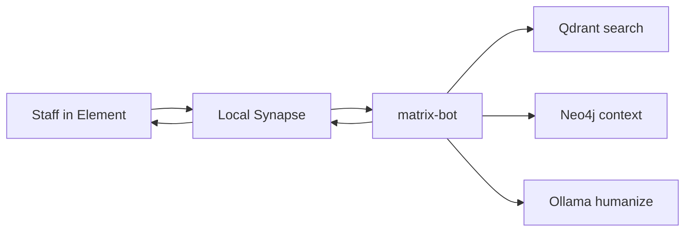
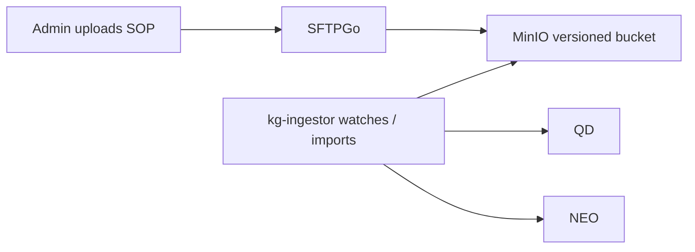
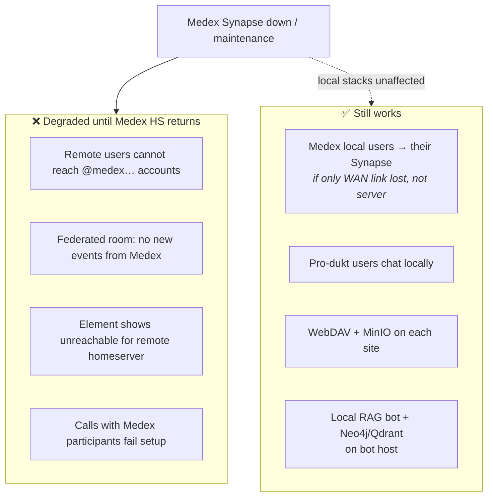
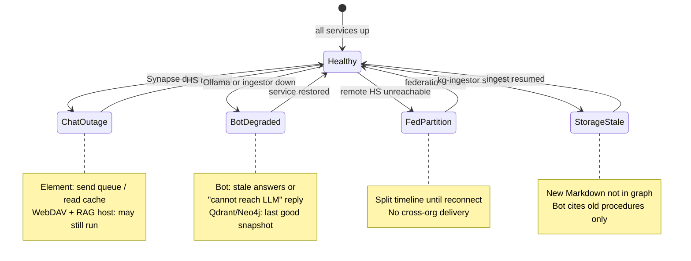

**Edelweiss** · 2025–present  
**Context**: Healthcare and pflege (DemoCare) — knowledge base, document sharing, and **federated** secure chat between partner organisations

## Summary

**Edelweiss** combines a **go-second-brain** stack (Markdown → **Neo4j** + **Qdrant** → Matrix RAG bot), **WebDAV** document sharing ([SFTPGo + MinIO](/posts/webdav-sharing-sftpgo-minio/)), CuraSoft integration paths, and **federated Matrix** homeservers so pflege partners keep their own data while still sharing rooms and calls.

**On this page**: [platform architecture](#platform-architecture) · [what federation means](#what-federated-matrix-chat-means) · [federation topology](#federation-topology-three-homeservers) · [use cases](#use-cases) · [failover](#failover-when-a-homeserver-is-down) · [offline & degraded modes](#offline-and-degraded-edge-cases) · [video assistant](#video-assistant-mvp)

## Platform architecture

Knowledge, files, and chat are **separate planes** — chat can be down while documents and the local RAG stack still work on the same host.

| Plane | Stack | If it fails |
|-------|-------|-------------|
| Knowledge | `edelweiss/compose.yml` — docs, neo4j, qdrant, kg-ingestor, matrix-bot | Bot answers from **last ingested** graph; see [degraded modes](#offline-and-degraded-edge-cases) |
| Documents | [webdav-sharing](/posts/webdav-sharing-sftpgo-minio/) — SFTPGo + MinIO | Chat unaffected; staff still open shared folders |
| Chat | Per-org Synapse + coturn + LiveKit | Local rooms work; **federated** partners unreachable until HS returns |

## Repositories & stacks

| Component | Focus |
|-----------|-------|
| [go-second-brain](https://github.com/eSlider/go-second-brain) / edelweiss | Markdown KB → Neo4j + Qdrant → Matrix RAG bot |
| webdav-sharing (private) | MinIO, SFTPGo role-based file sharing |
| sublimation | 2026 tooling experiments |
| curasoft/pyxamstore | CuraSoft integration path |

## Docker Compose (selected)

| Stack | Services |
|-------|----------|
| `edelweiss/compose.yml` | docs, neo4j, qdrant, kg-ingestor, matrix-bot |
| `webdav-sharing/docker-compose.yml` | MinIO, SFTPGo, bootstrap |

## What federated Matrix chat means

In a **non-federated** setup, every user lives on one company's Matrix server (e.g. all `@user:company.internal`). In **federation**, each partner runs **their own homeserver** and users keep IDs on **their domain**:

| User | Homeserver | Data residency |
|------|------------|----------------|
| `@anna:pro-dukt.de` | `chat.pro-dukt.de` | Pro-dukt infrastructure |
| `@care:medex-pflegedienst.de` | `chat.medex-pflegedienst.de` | Medex Pflegedienst |
| `@ops:produktor.io` | `chat.produktor.io` | ProProdukt SL / produktor ops |

**Federation** lets those users join the **same encrypted room**. When Anna sends a message:

1. Her **Element** client talks to **her** Synapse (`chat.pro-dukt.de`).
2. Synapse delivers locally and **federates** copies to remote homeservers over **HTTPS :443** (no public :8448 in our model).
3. Medex and produktor users receive the event on **their** Synapse; Element shows one shared timeline.

**Why healthcare partners want this**

- **Data sovereignty** — each org controls its own server, backups, and access policy.
- **Shared coordination** — one room for handoffs, shift notes, and ops without forcing everyone onto a single SaaS tenant.
- **Same RTC stack per site** — [coturn + LiveKit](/posts/matrix-webrtc-voip-production/) on each homeserver so voice/video works with Element Call while federation handles signalling across orgs.

Federation is **not** email forwarding — it is synchronised, end-to-end-capable room state between independent Matrix servers. Deeper RTC detail: [Matrix / WebRTC / VoIP production](/posts/matrix-webrtc-voip-production/).

## Federation topology (three homeservers)

TLS termination and `/.well-known/matrix/server` delegation sit behind **Nginx Proxy Manager** on each site. `federation_domain_whitelist` restricts which partner domains Synapse will talk to — intentional trust boundary, not open public federation.

## Use cases

### 1 — Cross-org care coordination (federated room)

Nurses and coordinators share **one room** without migrating accounts to a central tenant. Room history is replicated per homeserver policy.

### 2 — SOP lookup via Matrix RAG bot

Staff ask the **knowledge bot** in Element (`!brain` or configured prefix); answers ground in ingested Markdown (care procedures, internal wiki).

Full voice/STT path: [Video assistant MVP](/posts/edelweiss-video-assistant-mvp/).

### 3 — Versioned documents (WebDAV)

Role-based folders (e.g. finance vs field staff) via [webdav-sharing](/posts/webdav-sharing-sftpgo-minio/) — **independent** of Matrix uptime. Typical pattern: SOP PDF in WebDAV, summary ingested into Neo4j/Qdrant, bot cites the ingested chunk in chat.

## Failover when a homeserver is down

Federation is **best-effort synchronous** — there is no single global “always on” control plane. Behaviour when **`chat.medex-pflegedienst.de` is offline**:

| Scenario | Local staff | Remote partners |
|----------|-------------|-----------------|
| Partner HS down | Unaffected on **their** server | See “can't reach homeserver”; **cached** room history may still read offline |
| Partner WAN only | HS healthy | Federation retries; intermittent delivery gaps |
| All three HS up | Full federation + calls | Normal |

**Ops practice**: announce maintenance windows in a local broadcast room; rely on **WebDAV** and exported SOPs when chat is in read-only outage; bot on produktor/pro-dukt can still serve **local** KB if ingest completed before outage.

## Offline and degraded edge cases

| Failure | User-visible effect | Mitigation |
|---------|---------------------|------------|
| **Synapse down** (hours) | No send/receive on that domain; calls fail | Maintenance page; use WebDAV + phone fallback; queue returns when HS up |
| **Federation partition** | Remote members greyed out; messages don't cross | Fix TLS/DNS/whitelist; events backfill when link returns |
| **coturn / LiveKit down** | Text chat OK; **voice/video broken** on that site | Fail to text + voice messages; [TURN debugging](/posts/matrix-webrtc-voip-production/) |
| **Ollama down** | Bot cannot generate; may echo retrieval-only or error | Restart inference; optional API fallback (not default — local-first) |
| **Neo4j or Qdrant down** | Bot retrieval fails | Restart DB volumes; bot offline until stores healthy |
| **kg-ingestor down** | Chat works; **answers miss new docs** | Manual ingest run after restore |
| **MinIO / SFTPGo down** | Chat OK; **file share offline** | Separate compose stack — restore volumes independently |

Design intent: **no single choke point**. Documents and knowledge stores can outlive a chat maintenance window; federation isolates blast radius to one org's domain.

## Video assistant MVP

Matrix knowledge bot for Element — text, voice messages, and calls. **STT** → **Qdrant** + **Neo4j** GraphRAG → **Ollama** (Gemma / Bonsai) humanize → **TTS**; user feedback stores back into the knowledge graph.

[Architecture and diagrams →](/posts/edelweiss-video-assistant-mvp/) · [v2 Wan Streamer lane](/posts/edelweiss-video-assistant-mvp/#architecture-mvp-v2--wan-streamer-lane)

## Related

[go-second-brain](/posts/go-second-brain-knowledge-graph-rag/) · [Matrix / WebRTC / VoIP production](/posts/matrix-webrtc-voip-production/) · [WebDAV sharing](/posts/webdav-sharing-sftpgo-minio/) · [Video assistant MVP](/posts/edelweiss-video-assistant-mvp/) · [produktor.io](/posts/produktor-io-proprodukt/)
