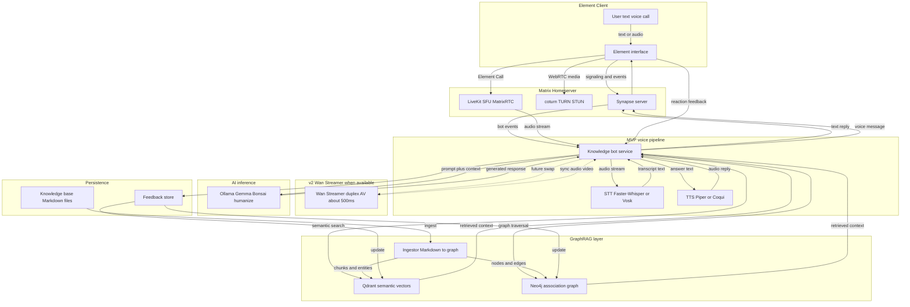
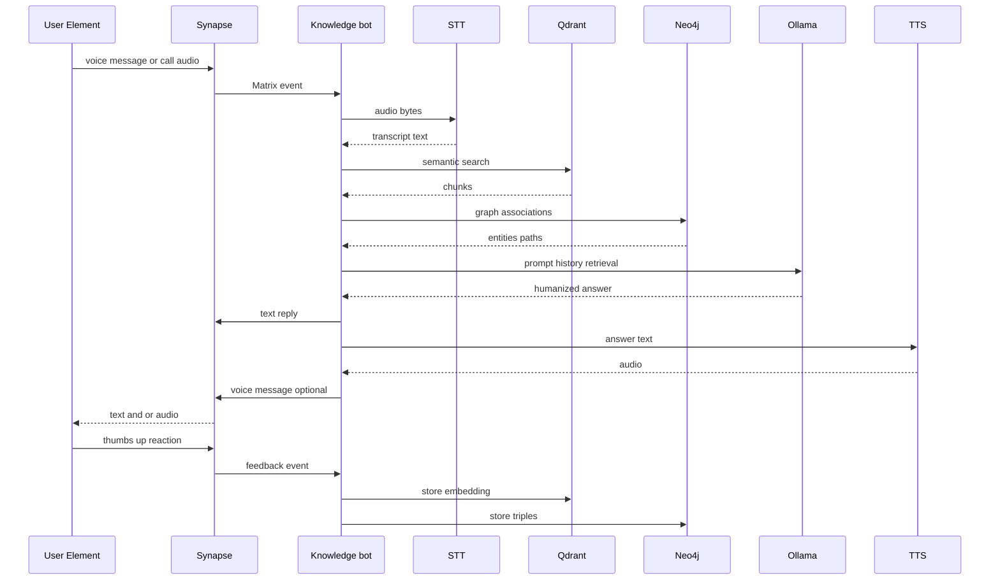

**Edelweiss** video assistant · MVP design · 2026-06

Matrix-native **knowledge assistant** for healthcare users in **Element**: converse by text, voice message, or call; answers grounded in **Edelweiss** Markdown → **Neo4j** + **Qdrant**, humanized by local **Ollama** (Gemma / Bonsai).

## Builds on

- **Matrix / WebRTC stack** — Synapse, coturn, LiveKit (architecture below)
- [go-second-brain](/posts/go-second-brain-knowledge-graph-rag/) — GraphRAG bot SDK
- [Edelweiss healthcare stack](/posts/edelweiss-healthcare-knowledge-base/) — pflege homeservers

## MVP flow

1. User speaks or types in Element room with bot
2. **STT** (Faster-Whisper / Vosk) for audio
3. **GraphRAG** — Qdrant semantic chunks + Neo4j associations
4. **Ollama** — generate + humanize (Gemma / Bonsai)
5. Reply as text + optional **TTS** (Piper / Coqui)
6. Positive **feedback** → store refined context in Qdrant + Neo4j

Voice uses a dedicated bot media path; the room timeline stays the audit trail and text fallback.

Source: [`video-assistant-architecture.mmd`](https://github.com/eSlider/cv/blob/main/projects/edelweiss/video-assistant-architecture.mmd) in cv repo.

## One voice turn

## Rollout

| Phase | Deliverable |
|-------|-------------|
| 1 | Text `!brain` RAG (shipped in go-second-brain) |
| 2 | Voice message STT → RAG → TTS |
| 3 | Element Call / LiveKit bot join |
| 4 | Reaction feedback → graph + vector store |
| 5 | [Wan Streamer](https://wan-streamer.com/) — end-to-end duplex voice/video when available (~500 ms vs modular STT+RAG+TTS) |

## Next version — Wan Streamer

MVP uses a **modular** voice path (STT → GraphRAG → Ollama → TTS). The **next version** adapts **[Wan Streamer](https://wan-streamer.com/)** as soon as it is available for integration: one end-to-end streaming Transformer for real-time, full-duplex audio-visual interaction (~**200 ms** model-side, ~**500–550 ms** total per their v0.1 figures — much faster than chained ASR/LLM/TTS).

GraphRAG (Qdrant + Neo4j) remains the **knowledge layer**; Wan Streamer becomes the **interaction layer** (voice reply, optional synchronized video agent).

**Portfolio detail**: [github.com/eSlider/cv — video-assistant-mvp](https://github.com/eSlider/cv/blob/main/projects/edelweiss/video-assistant-mvp.md)

## Related

[go-second-brain](/posts/go-second-brain-knowledge-graph-rag/) · [Edelweiss healthcare](/posts/edelweiss-healthcare-knowledge-base/) · [Bonsai Ollama proxy](/posts/bonsai-ollama-q1-proxy/)
