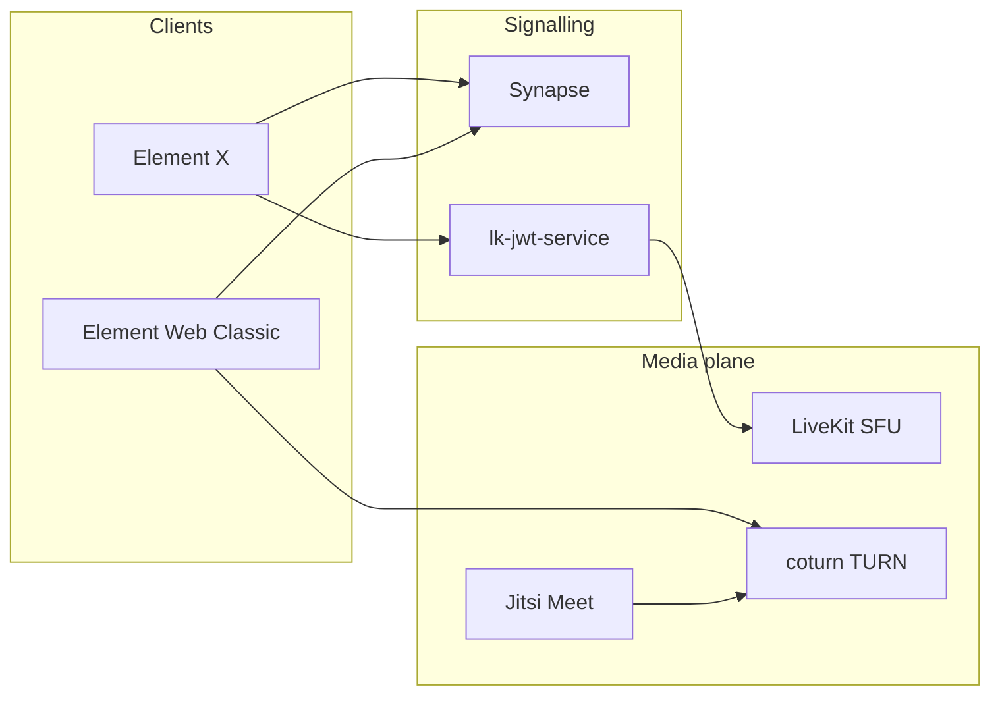

Production **video and audio** over **WebRTC**: self-hosted **Matrix** homeservers with **Element** clients, **coturn** TURN/STUN, **LiveKit** SFU (MatrixRTC / Element Call), and **Jitsi Meet** for on-premise conferences.

**Period**: 2024–present (~2 years active ops)  
**Primary stack**: `produktor/orange/chat` on long-term archive host (Synapse, Element, coturn, LiveKit, Jitsi)

## Deployments

| Organization | Homeserver | RTC components |
|--------------|------------|----------------|
| **ProProdukt / produktor.io** | `chat.produktor.io` | Synapse, Element Web, coturn, LiveKit + lk-jwt, Jitsi (compose profile), NPM TLS |
| **Pro-dukt** (partner) | `chat.pro-dukt.de` | Federated homeserver; TURN + LiveKit paths aligned with produktor |
| **Medex Pflegedienst** (healthcare) | `chat.medex-pflegedienst.de` | Third federated homeserver; same RTC parity model |
| Markets Platform (Illja contract) | `synapse.server.moda1.uk` | Synapse, Element PWA, optional coturn profile |

Three-way federation: TLS on **443** via Nginx Proxy Manager, `/.well-known/matrix/server` delegation, `federation_domain_whitelist` on every Synapse. **No WAN 8448** in this model.

## Architecture (Element X / MatrixRTC path)

| Client / flow | Signalling | Media path |
|---------------|------------|------------|
| **Element X** (MatrixRTC) | `org.matrix.msc4143.rtc_foci` → LiveKit JWT URL | **LiveKit SFU** (UDP port range + TCP 7881 ICE fallback) |
| **Element Classic** (1:1 VoIP) | Synapse `turn_uris` + `/voip/turnServer` | **P2P WebRTC** + **coturn** relay when NAT blocks direct path |
| **Jitsi Meet** (on-prem conferences) | Jitsi web + JVB | UDP **10000**, optional coturn **5349** TLS |

## Compose services (produktor chat stack)

| Service | Role |
|---------|------|
| `synapse` | Matrix homeserver; `turn_uris`, MSC4143 rtc_foci, federation |
| `riot-web` | Element Web client config |
| `coturn` | TURN/STUN; `external-ip`, relay UDP range, shared secret with Synapse |
| `livekit` | SFU for MatrixRTC / Element Call |
| `lk_jwt` | MatrixRTC authorisation; public `wss://…/livekit/sfu` URL |
| `jitsi` | On-prem meet stack (compose profile); transcripts volume for capture |
| `ketesa` | Synapse admin UI (MAS/OIDC-aware) |

Reverse proxy and WAN port forwards sit outside compose (NPM on the gitea stack): WebSocket upgrade headers for LiveKit SFU, static `/.well-known/matrix/*` where Synapse does not serve them.

## Problems worth documenting

These are the failures that only show up in production:

1. **Off-LAN calls work on Wi-Fi, fail on mobile data** → missing UDP relay range on the router (coturn `49160–49200`, LiveKit `50100–50200`).
2. **First MatrixRTC call OK, second never connects** → `LIVEKIT_URL` must be the public WSS path; `rtc.node_ip` must match coturn `external-ip` (not auto-detected STUN on a different WAN).
3. **TURN hostname resolves but media dies** → clients hit `turn:stun.example:3478` on the **public IP**, not the NPM HTTPS vhost on port 443.

## Audio capture and voice bots

- **Jitsi**: transcript mounts and recording-related web env (on-prem meet capture).
- **Matrix Classic**: P2P + TURN for voice rooms.
- **[go-second-brain](/posts/go-second-brain-knowledge-graph-rag/)**: Matrix RAG bot with optional **Ollama** STT/TTS voice path on the same homeserver ecosystem.

## Tech stack

Docker Compose · Synapse · Element Web/X · coturn · LiveKit · lk-jwt-service · Jitsi Meet · Nginx Proxy Manager · Let's Encrypt · Python (Synapse modules)

## Related

[produktor.io](/posts/produktor-io-proprodukt/) · [Docker Compose patterns](/posts/docker-compose-stack-patterns/) · [go-second-brain](/posts/go-second-brain-knowledge-graph-rag/) · [Markets Platform](/posts/markets-platform-tradeplatform/) · [self-ca](/posts/self-ca-private-certificates/) (TLS for private Matrix/Gitea hosts)
