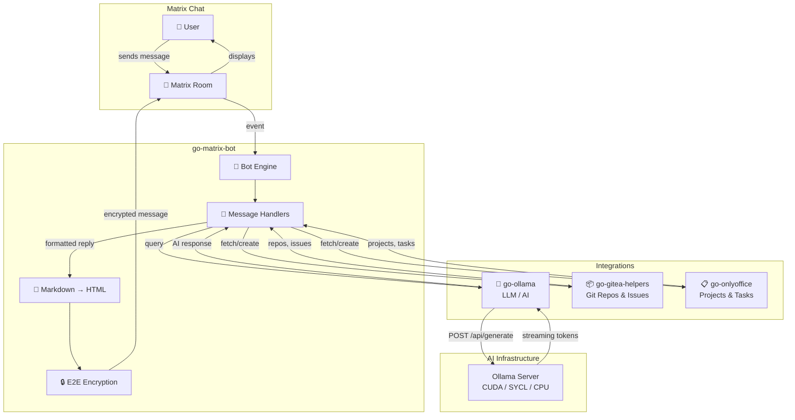
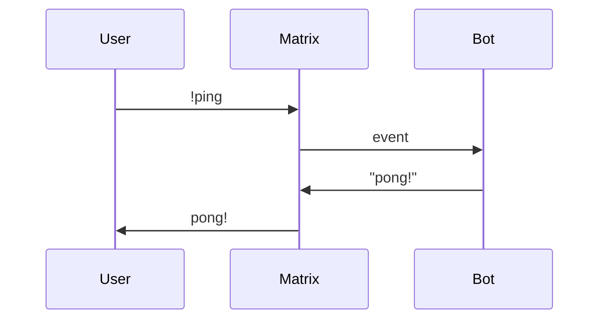
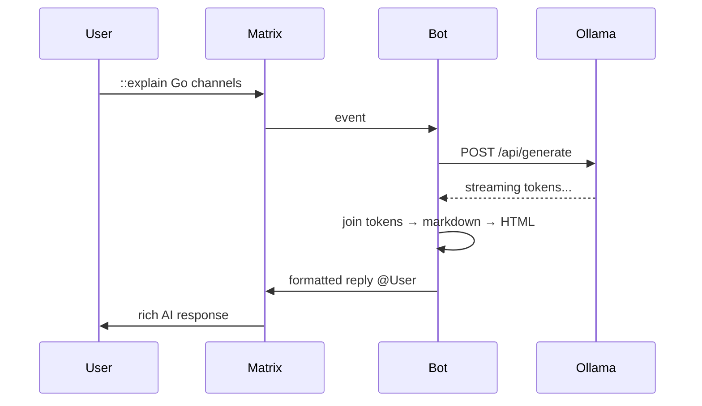
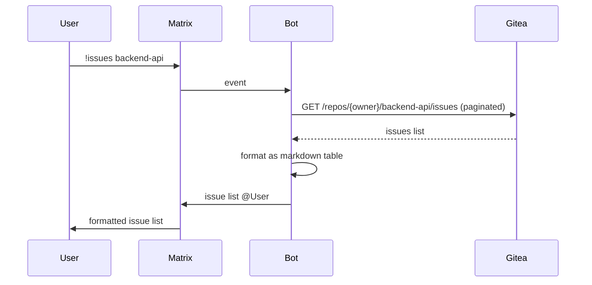

**go-matrix-bot** is a Go library for building [Matrix](https://matrix.org/) bots with **end-to-end encryption**, built on [mautrix-go](https://github.com/mautrix/go). It composes with [go-ollama](https://github.com/eSlider/go-ollama), [go-gitea-helpers](https://github.com/eSlider/go-gitea-helpers), and [go-onlyoffice](https://github.com/eSlider/go-onlyoffice) for AI and project-management workflows in chat.

**Repository**: [github.com/eSlider/go-matrix-bot](https://github.com/eSlider/go-matrix-bot)

## Architecture

## Integration patterns

### Echo / utility bot

### AI assistant (Ollama)

### Gitea issue tracker

## Where it ships

- [go-second-brain](/posts/go-second-brain-knowledge-graph-rag/) — Matrix RAG bot (`!brain` prefix)
- [Edelweiss video assistant MVP](/posts/edelweiss-video-assistant-mvp/) — healthcare knowledge bot in Element
- [Go libraries toolkit](/posts/go-libraries-toolkit/) — composable module cluster

## Tech stack

Go · mautrix-go · E2E encryption · Ollama · Gitea API · OnlyOffice API
