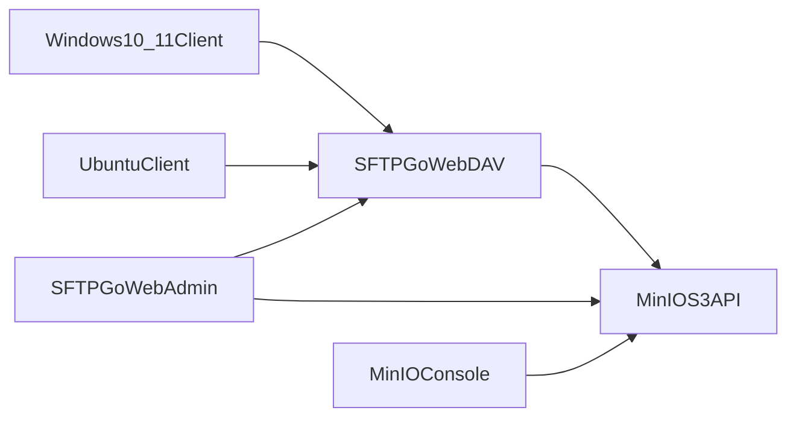
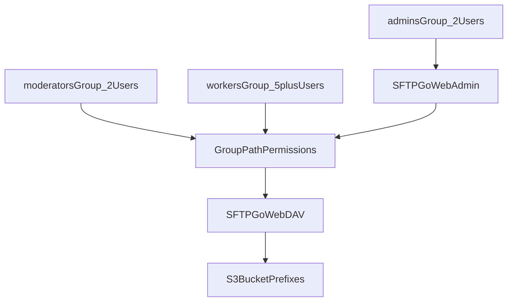

**webdav-sharing** is a Docker Compose stack for a managed **WebDAV** file service with **S3-compatible** storage — Windows 10/11 and Ubuntu clients, role-based folders, and versioned object history.

**Repository**: [github.com/eSlider/webdav-sharing](https://github.com/eSlider/webdav-sharing)

## Why this stack

- **SFTPGo** — mature WebAdmin UI for users, groups, and path permissions; native WebDAV
- **MinIO** — reliable S3 backend with versioning for document history and restore
- **mc bootstrap** — one-shot bucket/user setup via MinIO Client

Typical use: small-team intranet documents, finance (`buchhaltung`) vs operations (`PDL`) folder segregation, and backup-friendly versioned storage without a full groupware suite.

## Architecture



## Access model



## Quick start

```bash
cp .env.example .env   # edit secrets
docker compose up -d
```

| Service | Default URL |
|---------|-------------|
| SFTPGo WebAdmin | `http://localhost:18080/web/admin` |
| WebDAV | `http://localhost:11080` |
| MinIO Console | `http://localhost:19001` |

After first admin setup, bootstrap groups and sample users:

```bash
SFTPGO_ADMIN_USER='admin' SFTPGO_ADMIN_PASSWORD='…' ./bin/init.sh
```

## Operations

- Persisted volumes: `minio_data`, `sftpgo_state`, `sftpgo_data`
- Production: terminate TLS at a reverse proxy in front of SFTPGo and MinIO
- Object version restore: MinIO Console or `mc` — SFTPGo manages access, not S3 version history

## Related

[Edelweiss healthcare stack](/posts/edelweiss-healthcare-knowledge-base/) · [produktor.io platform](/posts/produktor-platform-self-hosted-stack/) · [Docker Compose patterns](/posts/docker-compose-stack-patterns/)

## Tech stack

Docker Compose · SFTPGo · MinIO · S3 · WebDAV
